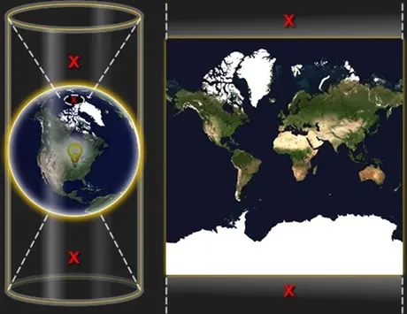

# cesium笔记
- 参考文章：https://blog.csdn.net/weixin_45782925/article/details/123269490
- 官网：https://cesium.com/learn/cesiumjs-learn/
- bilibili up主:https://space.bilibili.com/597185371
### 地图
|  变量   | 说明  |
|  ----  | ----  |
| lang  | 显示语言，zh_cn：中文，en：英文 |
| scl  | 设置标注还是底图，1表示标注，2表示底图 |
| style  | 地图类型控制，6卫星（st）,7简图（st rd），8详图（不透明rd，透明st） |
	
1.影像图
https://webst01.is.autonavi.com/appmaptile?x=54658&y=26799&z=16&style=6
2.道路纯图
https://wprd01.is.autonavi.com/appmaptile?lang=zh_cn&size=1&style=7&x=54658&y=26799&z=16&scl=1&ltype=2
3.道路简图
http://webrd01.is.autonavi.com/appmaptile?x=54658&y=26799&z=16&size=1&scale=1&style=7
4.道路详图
http://webrd01.is.autonavi.com/appmaptile?x=54658&y=26799&z=16&lang=zh_cn&size=1&scale=1&style=8
5.纯道路图
http://wprd01.is.autonavi.com/appmaptile?x=54658&y=26799&z=16&lang=zh_cn&size=1&scl=1&style=8&ltype=11
6.纯地标图
https://wprd01.is.autonavi.com/appmaptile?lang=zh_cn&size=1&style=8&x=54658&y=26799&z=16&scl=1&ltype=4
7.路网注记图
http://webst01.is.autonavi.com/appmaptile?x=54658&y=26799&z=16&lang=zh_cn&size=1&scale=1&style=8

### 墨卡托投影：

### 坐标系转化
- 相关文章:https://www.cnblogs.com/matanzhang/p/11846929.html

### geoJson
- 在线生成geoJson:
https://link.csdn.net/?target=http%3A%2F%2Fdatav.aliyun.com%2Ftools%2Fatlas%2F%23%26lat%3D33.521903996156105%26lng%3D104.29849999999999%26zoom%3D3
- 教程：
https://blog.csdn.net/qq_42765966/article/details/98759365

### 获取地形
https://www.gscloud.cn/search   地理空间数据云

### 合并图层 
qgis
- 教程：https://blog.csdn.net/qq_41159191/article/details/129008347

### 数据切片
cesiumLab：http://www.cesiumlab.com/

### 倾斜摄影
通用格式：osgb  
cesium：3dtiles
